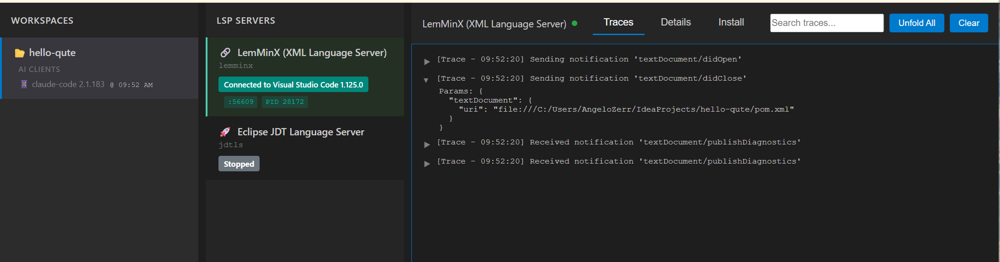

# MCP Language Tools

> **Note**: This is a Proof of Concept (POC) project.

MCP Language Tools is an [MCP (Model Context Protocol)](https://modelcontextprotocol.io/) server that gives AI assistants the power of [LSP (Language Server Protocol)](https://microsoft.github.io/language-server-protocol/) and [DAP (Debug Adapter Protocol)](https://microsoft.github.io/debug-adapter-protocol/) through MCP tools.

## What is it?

**MCP Language Tools acts as a platform for [LSP (Language Server Protocol)](https://microsoft.github.io/language-server-protocol/) language servers and [DAP (Debug Adapter Protocol)](https://microsoft.github.io/debug-adapter-protocol/) debug adapters**, similar to VS Code. Just as VS Code hosts extensions to provide IDE features, MCP Language Tools manages LSP and DAP servers and exposes their capabilities to any AI assistant through MCP.

This means AI assistants can leverage the same tooling that developers use in their IDEs: diagnostics, code navigation, refactoring, debugging, and more — for **any language**.

### Key highlights

- **Multi-language support**: Java, JavaScript, Python, Go, Rust, C/C++, XML, YAML, Kotlin, Dart, PHP, Lua, Dockerfile, and more
- **Both LSP and DAP**: Full language server support (diagnostics, navigation, refactoring) and debug adapter support (breakpoints, stepping, variables)
- **Server collaboration**: LSP and DAP servers can communicate with each other (e.g., MicroProfile LS leverages JDT.LS for Java type resolution). See [Bind Mechanism](docs/bind-mechanism.md)
- **Auto-installation**: Language servers and debug adapters are automatically downloaded and installed on first use
- **Declarative extensions**: Each server is defined by two JSON files (`server.json` + `installer.json`) — no code required. For advanced cases (e.g., JDT.LS), Java code can be used via SPI
- **Extensible via classpath or bundles**: Contribute extensions as Maven modules on the classpath, or add them at runtime via MCP tools and admin UI
- **IDE settings support**: Loads `.vscode/settings.json` and `.bob/settings.json` to send as LSP `workspace/configuration`, so language servers receive the same settings as in your IDE
- **Admin console**: Web UI to manage servers, monitor workspaces, and view traces at `http://localhost:7654/admin`
- **Any MCP client**: Works with [Claude Desktop](https://claude.ai/download), [Claude Code](https://docs.anthropic.com/en/docs/claude-code), [Bob IDE](https://bob.ibm.com/), and any MCP-compatible assistant



## Quick Start

- **[Getting Started (LSP)](docs/getting-started.md)** — Get diagnostics, references, and code navigation working in 5 minutes
- **[Getting Started (DAP)](docs/getting-started-dap.md)** — Debug your code with breakpoints, stepping, and variable inspection

## MCP Tools

### LSP Tools

| Tool | Description |
|------|-------------|
| `get_diagnostics` | Get errors and warnings for a file |
| `get_all_diagnostics` | Get diagnostics for all files in a workspace |
| `goToDefinition` | Jump to where a symbol is defined |
| `goToDeclaration` | Jump to where a symbol is declared |
| `find_references` | Find all usages of a symbol |
| `findImplementations` | Find implementations of an interface/abstract class |
| `get_code_actions` | Get quick fixes and refactoring suggestions |
| `rename` | Rename a symbol across the workspace |
| `searchWorkspaceSymbols` | Search for classes, methods, variables by name |
| `open_document` / `close_document` | Keep a file open for multiple LSP operations |

### DAP Tools

| Tool | Description |
|------|-------------|
| `list_debug_adapters` | List available debug adapters with supported languages |
| `get_debug_templates` | Get launch/attach configuration templates |
| `start_debugging` | Launch or attach a debug session |
| `list_debug_sessions` / `close_debug_session` | Manage debug sessions |
| `set_breakpoint` / `remove_breakpoint` / `list_all_breakpoints` | Manage line breakpoints |
| `set_instruction_breakpoint` / `remove_instruction_breakpoint` / `list_instruction_breakpoints` | Manage instruction-level breakpoints |
| `continue_execution` / `pause_execution` | Continue or pause execution |
| `step_over` / `step_in` / `step_out` | Step through code (statement or instruction granularity) |
| `get_stack_trace` | View the call stack |
| `list_threads` | List all threads in the debugged program |
| `get_scopes` / `get_variables` | Inspect variable scopes and values |
| `get_local_variables` | Shortcut for local variables in the current frame |
| `evaluate_expression` | Evaluate expressions in debug context |
| `get_console_output` | Read program stdout/stderr output |
| `disassemble` | Disassemble instructions at a memory address |
| `detach_from_process` | Detach without terminating the process |
| `get_debug_statistics` | Get statistics about active debug sessions |

### Java Tools (from Java extension)

| Tool | Description |
|------|-------------|
| `java_get_type_hierarchy` | Get supertypes, super interfaces, and subtypes of a Java type |
| `java_get_call_hierarchy_incoming` | Find all callers of a method |
| `java_get_call_hierarchy_outgoing` | Find all methods called by a method |
| `java_find_annotation_usages` | Find all usages of a Java annotation type |
| `java_find_type_instantiations` | Find all `new Type()` instantiations of a Java type |
| `java_get_complexity_metrics` | Compute cyclomatic complexity and LOC per method |

### Extension & Workspace Tools

| Tool | Description |
|------|-------------|
| `list_extensions` | List all installed extensions |
| `add_extension` | Add a new extension (LSP/DAP servers) |
| `remove_extension` | Remove an extension |
| `add_lsp_server` / `add_dap_server` | Add a server to an extension |
| `remove_lsp_server` / `remove_dap_server` | Remove a server |
| `enable_extension` / `disable_extension` | Enable or disable an extension |
| `list_language_servers` | List language servers with status |
| `listWorkspaces` | List active workspaces |

## Bundled Extensions

Each extension groups LSP and/or DAP servers for a language:

| Extension | LSP Server | DAP Server |
|-----------|-----------|------------|
| **Java** | JDT.LS | java-debug |
| **JavaScript** | typescript-language-server | vscode-js-debug |
| **Python** | Pyright | debugpy |
| **Go** | gopls | go-delve |
| **Rust** | rust-analyzer | — |
| **C/C++** | clangd | codelldb |
| **XML** | LemMinX | — |
| **YAML** | yaml-language-server | — |
| **Kotlin** | kotlin-language-server | — |
| **Dart** | dart-lsp | dart-debug |
| **PHP** | Intelephense | vscode-php-debug |
| **Lua** | lua-language-server | — |
| **Dockerfile** | dockerfile-language-server | buildx-dockerfile |
| **MicroProfile** | microprofile-ls | — |
| **Quarkus** | quarkus-ls, qute-ls | — |
| **Liberty** | lemminx-liberty, liberty-ls | — |

## Adding Your Own Extensions

You can add custom LSP/DAP servers in three ways:

1. **Via MCP tools**: Use `add_extension`, `add_lsp_server`, `add_dap_server` — the AI assistant can do it for you
2. **Via Admin UI**: Use the extensions management page at `http://localhost:7654/admin`
3. **Via extension modules**: Create a Maven module with server descriptors

See the **[Extension Guide](docs/extensions.md)** for details.

## Admin Console

Access the admin UI at `http://localhost:7654/admin` to:

- **Manage extensions**: Install, enable, disable, remove extensions and their servers
- **Control servers**: Start, stop, restart LSP and DAP servers
- **Monitor workspaces**: View active workspaces and connected MCP clients
- **View traces**: Debug LSP and MCP communication
- **Debug sessions**: Monitor active debug sessions

See the **[Admin UI Guide](docs/admin-ui.md)** for details.

## Running

### Dev mode (with hot-reload)

```bash
cd dev
../mvnw quarkus:dev
```

The server starts at `http://localhost:7654`. Admin UI at `http://localhost:7654/admin`.

### Configure your MCP client

```json
{
  "mcpServers": {
    "mcp-languagetools": {
      "type": "http",
      "url": "http://localhost:7654/mcp"
    }
  }
}
```

## Project Structure

```
mcp-lsp/
├── core/                        # Core framework (LSP/DAP integration, MCP tools, admin UI)
├── extensions/                  # Language extensions
│   ├── java/                    # Java (JDT.LS + java-debug)
│   ├── xml/                     # XML (LemMinX)
│   ├── javascript/              # JavaScript/TypeScript (ts-language-server + vscode-js-debug)
│   ├── python/                  # Python (Pyright + debugpy)
│   ├── go/                      # Go (gopls + go-delve)
│   ├── rust/                    # Rust (rust-analyzer)
│   ├── c/                       # C/C++ (clangd + codelldb)
│   ├── dart/                    # Dart (dart-lsp + dart-debug)
│   ├── yaml/                    # YAML
│   ├── kotlin/                  # Kotlin
│   ├── php/                     # PHP (Intelephense + vscode-php-debug)
│   ├── lua/                     # Lua
│   ├── dockerfile/              # Dockerfile
│   ├── microprofile/            # MicroProfile
│   ├── quarkus/                 # Quarkus + Qute
│   └── liberty/                 # Liberty
├── admin/                       # Admin UI module
└── dev/                         # Dev distribution (core + all extensions)
```

## Technology Stack

- **[Quarkus](https://quarkus.io/)** — Java framework
- **[Quarkus MCP Server](https://docs.quarkiverse.io/quarkus-mcp-server/dev/index.html)** — MCP implementation
- **[LSP4J](https://github.com/eclipse-lsp4j/lsp4j)** — LSP implementation
- **[DAP4J](https://github.com/nicoschl/dap4j)** — DAP implementation

## Documentation

- **[Getting Started (LSP)](docs/getting-started.md)** — Code validation and navigation
- **[Getting Started (DAP)](docs/getting-started-dap.md)** — Debugging
- **[Extension Guide](docs/extensions.md)** — Add your own servers
- **[Admin UI Guide](docs/admin-ui.md)** — Web console
- **[Bind Mechanism](docs/bind-mechanism.md)** — How servers collaborate
